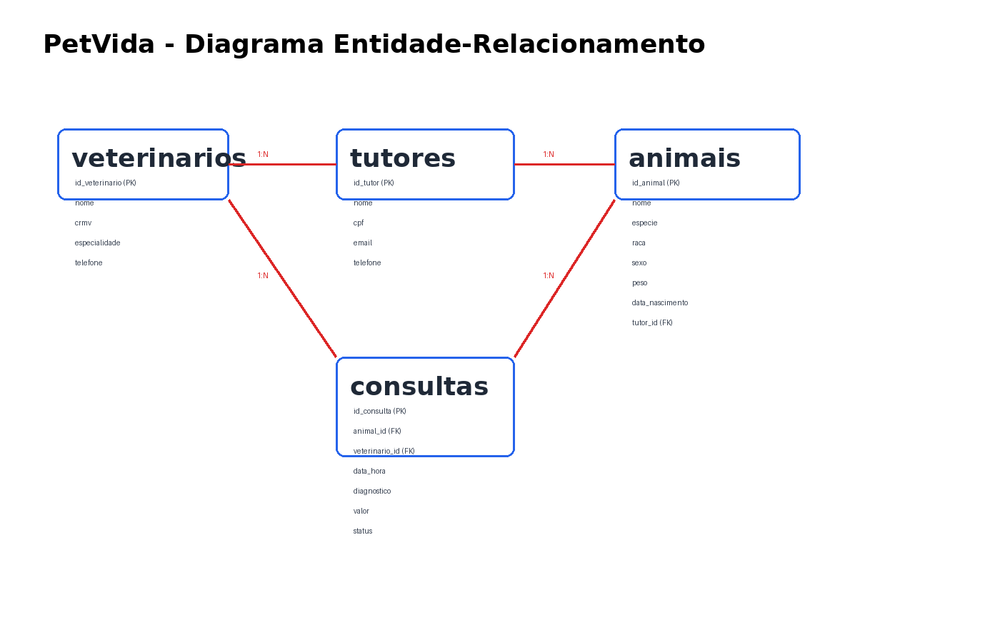

# PetVida


PetVida é uma API REST para gestão de clínica veterinária, com foco em cadastro de pets, consultas, pagamentos e relatórios financeiros. O projeto conecta um banco MySQL com uma aplicação Node.js/Express, permitindo integrar procedimentos armazenados, views e regras de negócio em um fluxo completo de uso real.

A proposta do sistema é demonstrar como SQL e backend podem trabalhar juntos em uma solução prática, com endpoints para agenda, conclusão de consultas, registro de pagamentos e relatórios. O projeto foi desenvolvido como parte de uma atividade prática de banco de dados e API, com foco em organização, boas práticas e apresentação para avaliação.



## Tecnologias utilizadas

- Node.js
- Express.js
- MySQL 8
- mysql2
- dotenv
- cors
- Docker (opcional para subir o banco localmente)

## Instalação e execução

### 1. Clonar o repositório

```bash
git clone https://github.com/eduardodio23/Pet_vidc.git
cd Pet_vidc
```

### 2. Instalar dependências

```bash
npm install
```

### 3. Subir o banco MySQL

Você pode usar o Docker localmente:

```bash
docker run --name petvida-mysql -e MYSQL_ROOT_PASSWORD=root -e MYSQL_DATABASE=pet_vida -p 3306:3306 -d mysql:8.0
```

Ou utilizar um MySQL já configurado na máquina.

### 4. Importar o esquema e os dados

```bash
mysql -h 127.0.0.1 -uroot -proot pet_vida < database/schema.sql
mysql -h 127.0.0.1 -uroot -proot pet_vida < database/seeds.sql
mysql -h 127.0.0.1 -uroot -proot pet_vida < database/views.sql
mysql -h 127.0.0.1 -uroot -proot pet_vida < database/triggers.sql
mysql -h 127.0.0.1 -uroot -proot pet_vida < database/functions.sql
mysql -h 127.0.0.1 -uroot -proot pet_vida < database/security.sql
```

### 5. Iniciar a API

```bash
npm start
```

A API ficará disponível em:

```text
http://localhost:3001/api
```

### 6. Rodar testes

```bash
npm test
```

## Endpoints da API

| Método | Endpoint | Descrição |
| --- | --- | --- |
| GET | /api/health | Verifica a conexão com o banco |
| GET | /api/veterinarios | Lista veterinários |
| GET | /api/animais | Lista animais via view |
| GET | /api/agenda/:data | Lista agenda de uma data |
| POST | /api/consultas | Agenda uma consulta via procedure |
| PUT | /api/consultas/:id/concluir | Conclui uma consulta via procedure |
| POST | /api/pagamentos/:consulta_id | Registra pagamento via procedure |
| GET | /api/relatorios/dashboard | Retorna dados financeiros do dashboard |
| GET | /api/relatorios/inadimplentes | Lista consultas pendentes |

## Estrutura de pastas

```text
.
├── backups/
├── database/
│   ├── functions.sql
│   ├── reports.sql
│   ├── schema.sql
│   ├── security.sql
│   ├── seeds.sql
│   ├── triggers.sql
│   └── views.sql
├── docs/
│   └── der.png
├── src/
│   ├── app.js
│   ├── config/
│   └── routes/
├── test/
├── package.json
├── serve.js
└── README.md
```

## Autor

Eduardo Felipe  
LinkedIn: [linkedin.com](https://www.linkedin.com/)
